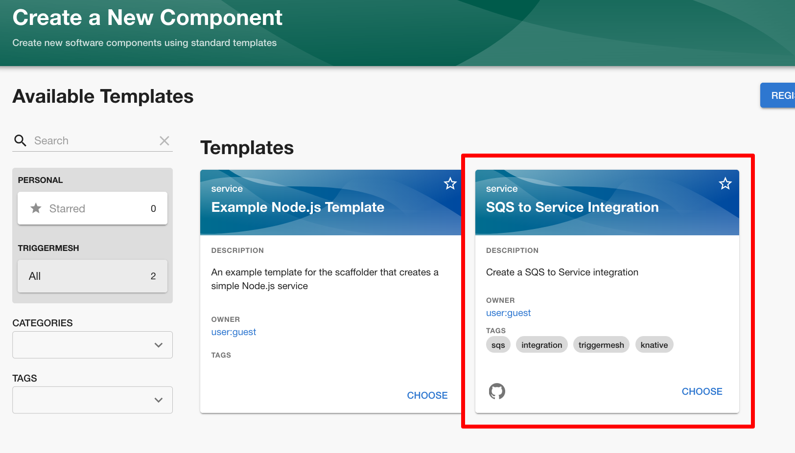

# TriggerMesh Bridge Template for Backstage

This is an experimental software template for creating a TriggerMesh integration
in Backstage. It demostrates the creation of integration that reads messages 
from an AWS Simple Queue Service (SQS) queue and delivers it to a service after 
applying a Transformation on the SQS message. 

The templates also demostrates how the automation could be setup in GitHub 
Actions in order to achieve CI/CD operations.

## Installation

Register the [template](https://github.com/triggermesh/backstage-sqs-bridge-template/blob/main/template.yaml) in your Backstage instance. Post installation, you
will see the **SQS to Service Integration** card appear in your components 
catalog.

## Usage

Please take a look at [this blog post](https://www.triggermesh.com/blog/triggermesh-bridge-template-for-backstage).
